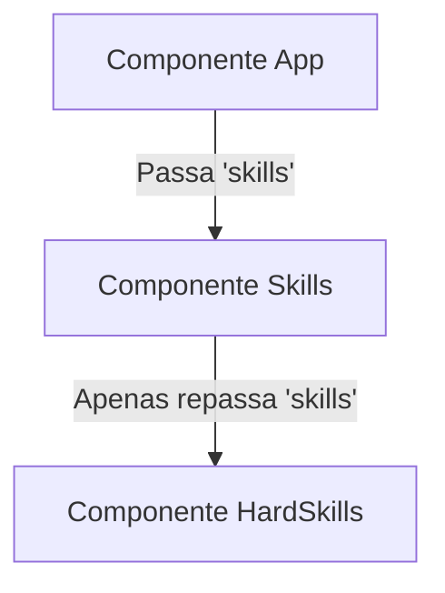

# Componentes

Os componentes em React são blocos de conteúdo da interface do usuário (UI) que têm uma única responsabilidade e tem como objetivo a reutilização e organização dos códigos do projeto (resumindo são como peças de lego).

Componentes são basicamente compostos por javascript, jsx(html) e css (opcional).

## Tipos de Componentes

- Componentes de Classe (Class Components)
- Componentes Funcionais (Functional Components)

## Estrutura de um componente

1. Criar a função e o conteúdo
2. Exportar e importar
3. Finalizar a estrutura
4. Adicionar interatividade

## Exportação e importação

### Duas maneiras de fazer exportação:

1. **Exportação Padrão (`export default`):**
   ```tsx
   function ComponentName() {
       return (
           <>
               <h1>ComponentName</h1>
           </>
       )
   }

   export default ComponentName;
   ```

2. **Exportação Nomeada (`export`):**
   ```tsx
   export function ComponentName() {
       return (
           <>
               <h1>ComponentName</h1>
           </>
       )
   }
   ```

### Maneira de importar:

#### Importação do `export default`:
```typescript
import ComponentName from './ComponentName';
// Nessa importação você pode usar qualquer nome personalizado ao importar, ex:
// import MyComponent from './ComponentName';
```

#### Importação do `export nomeado`:
```typescript
import { ComponentName } from './ComponentName';
// Nessa importação você deve obrigatoriamente usar o mesmo nome exportado entre as chaves:
// import { ComponentName } from './ComponentName';
```

---

## ⚡ Sintaxe JSX e Dinamismo

O **JSX** (JavaScript XML) permite que escrevamos estruturas semelhantes ao HTML diretamente dentro do código JavaScript. Além disso, o JSX nos dá um enorme poder dinâmico ao integrar lógica de programação com a interface.

### 1. Inserindo Expressões Dinâmicas
Qualquer expressão JavaScript válida (variáveis, chamadas de funções, operações matemáticas) pode ser inserida no meio do JSX envolvendo-a com chaves `{}`:
```tsx
const nome = "Nathan";
return <h1>Olá, {nome}!</h1>; // Renderiza: Olá, Nathan!
```

### 2. Integração com Objetos
Podemos armazenar dados estruturados em objetos e exibi-los mapeando suas propriedades diretamente na interface:
```tsx
const usuario = {
  nome: "Nathan Carvalho",
  cargo: "Desenvolvedor"
};

return (
  <div>
    <h3>{usuario.name}</h3>
    <p>{usuario.role}</p>
  </div>
);
```

### 3. Executando Funções Auxiliares
Podemos chamar funções de formatação de dados diretamente de dentro do JSX para transformar informações antes da renderização (como formatar datas ou moedas):
```typescript
function formatarData(data: Date) {
  return new Intl.DateTimeFormat("pt-BR").format(data);
}

// No retorno do JSX:
return <p>Acessado em: {formatarData(new Date())}</p>;
```

### 4. Estilos Inline Dinâmicos
Em JSX, os estilos em linha não são passados como strings. Em vez disso, passamos um objeto JavaScript. Por isso, a sintaxe utiliza chaves duplas: `style={{ }}`:
*   A primeira chave `{}` abre a expressão dinâmica JavaScript.
*   A segunda chave `{}` define o objeto de estilo.
*   Propriedades CSS compostas usam a nomenclatura camelCase (ex: `backgroundColor` em vez de `background-color`).

```tsx
return <ul style={{ color: "green", backgroundColor: "black" }}>...</ul>;
```

---

## ⚙️ Fundamentos de Props e Comunicação

As **Props** (propriedades) são a forma que os componentes React se comunicam. Elas permitem passar dados do componente pai (*parent*) para o componente filho (*child*), tornando nossos componentes reutilizáveis e dinâmicos.

### 1. Passando e Recebendo Props
As props são passadas no JSX como atributos HTML e recebidas no componente filho como um objeto na lista de parâmetros da função:
```tsx
// Filho:
interface SaudacaoProps {
  nome: string;
}
function Saudacao({ nome }: SaudacaoProps) {
  return <h1>Olá, {nome}!</h1>;
}

// Pai:
return <Saudacao nome="Nathan" />;
```

### 2. Valores Padrão (Default Values)
Podemos definir valores de fallback caso uma propriedade opcional não seja fornecida. Isso é feito diretamente através da atribuição de valores na desestruturação das props no filho:
```tsx
interface PerfilProps {
  nome: string;
  imagemUrl?: string; // Propriedade opcional (?)
}

// Se imagemUrl não for passada, usará o link padrão (fallback)
function Perfil({ nome, imagemUrl = "https://link-padrao.png" }: PerfilProps) {
  return ;
}
```

### 3. Passando Props com Spread Operator (`...`)
Se tivermos um objeto com várias propriedades que correspondem exatamente às props de um componente, podemos usar o operador spread (`...`) para passá-las todas de uma vez de forma limpa:
```tsx
const dadosUsuario = {
  nome: "Nathan Carvalho",
  cargo: "Desenvolvedor",
  imagemUrl: "https://avatar.png"
};

// Em vez de passar uma por uma: nome={dadosUsuario.nome} cargo={dadosUsuario.cargo}...
return <Perfil {...dadosUsuario} />;
```

### 4. Children Props (A Prop Especial `children`)
A propriedade `children` é uma prop embutida especial do React. Ela permite passar elementos ou outros componentes aninhados dentro das tags de fechamento de um componente contêiner:
```tsx
// Filho (Contêiner):
interface MolduraProps {
  children: React.ReactNode;
}
function Moldura({ children }: MolduraProps) {
  return <div style={{ border: "2px solid black", padding: "10px" }}>{children}</div>;
}

// Pai (Usando o contêiner):
return (
  <Moldura>
    <h2>Este título é passado como children!</h2>
    <p>Este texto também.</p>
  </Moldura>
);
```

### 5. Prop Drilling (Perfuração de Props)
**Prop Drilling** é a situação onde passamos propriedades através de múltiplos níveis de componentes intermediários apenas para alcançar um componente filho no final da árvore, mesmo que os componentes do meio não precisem dessas propriedades para nada.



*   **Problema:** Dificulta a manutenção do código, pois qualquer mudança na estrutura de dados obriga o desenvolvedor a alterar todos os componentes intermediários.
*   **Soluções Comuns:** Para evitar o Prop Drilling em projetos maiores, a comunidade utiliza ferramentas de gerenciamento de estado global como a **Context API** do React, ou bibliotecas como **Redux** ou **Zustand**.

---

## 📋 Renderização de Listas e a Importância das Keys

No desenvolvimento React, frequentemente precisamos exibir conjuntos de dados que vêm em formato de arrays (listas de produtos, comentários, usuários, etc.). Para isso, transformamos dados em elementos JSX dinamicamente.

### 1. Renderizando Listas com `.map()`
O método `.map()` do JavaScript é a ferramenta padrão em React para percorrer um array e retornar um elemento JSX correspondente para cada item:
```tsx
const tecnologias = ["React", "TypeScript", "Node.js"];

return (
  <ul>
    {tecnologias.map((tech, index) => (
      <li key={index}>{tech}</li>
    ))}
  </ul>
);
```

### 2. A Importância da Propriedade `key`
Quando renderizamos uma lista de elementos, o React precisa acompanhar a identidade de cada item para saber o que foi alterado, adicionado ou removido.
*   **Identidade estável:** A propriedade `key` dá um identificador único e estável para cada elemento.
*   **Performance (Reconciliação):** O algoritmo do React compara a árvore anterior com a nova e atualiza apenas os nós que realmente mudaram em vez de recriar a lista inteira no DOM real.

### 3. Boas Práticas ao Escolher Keys

#### ❌ O Perigo de Usar Índices (`index`) como Key
Usar o índice da iteração (0, 1, 2...) como `key` é aceitável **apenas** para listas 100% estáticas (que nunca mudam de posição, não são deletadas, nem ordenadas). Em listas dinâmicas, usar o índice é uma **má prática**:
*   **Bugs de renderização:** Se você deletar o primeiro item da lista, o React assume que o último item foi removido (porque os índices mudam de posição) e isso pode deixar dados legados em componentes internos (como inputs que perdem o foco ou mantêm valores digitados errados).
*   **Queda de performance:** O React precisará renderizar novamente itens que não mudaram de conteúdo.

#### ❌ O Perigo de Chaves Aleatórias (`Math.random()`)
Nunca gere valores aleatórios para a `key` dentro do `.map()` (ex: `key={Math.random()}`):
*   A cada renderização do componente, novos números serão gerados. O React achará que todos os itens são novos e vai desmontar e remontar toda a lista a cada alteração, causando perda de estado de foco e travamentos na tela.

####  A Prática Recomendada: IDs Únicos e Estáveis
Sempre prefira usar um identificador único do próprio banco de dados ou objeto:
```tsx
interface Skill {
  id: string; // Ex: "sk-1", "sk-2" (ou gerado por bibliotecas como uuid)
  nome: string;
}

interface HardSkillsProps {
  skills: Skill[];
}

function HardSkills({ skills }: HardSkillsProps) {
  return (
    <ul>
      {skills.map((skill) => (
        <li key={skill.id}>{skill.nome}</li>
      ))}
    </ul>
  );
}
```


