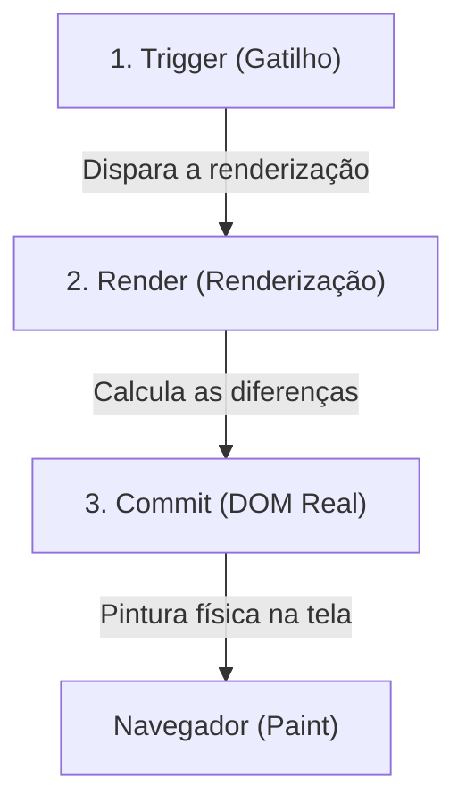

# 🔀 Renderização Condicional no React

Estudo teórico e prático sobre técnicas para renderizar elementos na interface de acordo com estados e condições lógicas específicas do aplicativo.

---

## 💡 O que é Renderização Condicional?

No React, renderização condicional significa exibir elementos da interface do usuário (JSX) com base em determinadas condições. É o mesmo conceito de blocos de controle no JavaScript comum (`if`, `&&`, `? :`), mas adaptados para o retorno de elementos de tela.

---

## 🛠️ Técnicas de Renderização Condicional

### 1. Retorno Condicional Antecipado (`if` padrão)
Ideal para quando queremos renderizar estruturas de tela completamente diferentes baseando-se em uma condição de barreira.

```tsx
interface ItemProps {
  name: string;
  check: boolean;
}

function Item({ name, check }: ItemProps) {
  if (check) {
    return <li className="item-completo">✅ {name}</li>;
  }
  return <li className="item-pendente">⬜ {name}</li>;
}
```

---

### 2. Retornando "Nada" com `null`
Se você quer ocultar completamente um componente ou elemento baseado em uma condição, retorne `null`. O React interpreta `null` como um espaço em branco e não renderiza nada na árvore do DOM.

```tsx
function AlertaDeErro({ temErro }: { temErro: boolean }) {
  if (!temErro) {
    return null; // O componente "some" da tela
  }
  return <div className="erro">Ocorreu um erro inesperado!</div>;
}
```

---

### 3. Operador Ternário (`condicao ? true : false`)
Excelente para fazer pequenas alterações no meio de um bloco JSX, como alterar textos, ícones ou classes CSS sem precisar duplicar o restante do HTML.

```tsx
return (
  <div className="item">
    <span>{check ? "✅" : "⬜"}</span>
    <p>{name}</p>
  </div>
);
```

---

### 4. Operador Lógico AND (`&&`)
Usado quando queremos renderizar um pedaço de JSX apenas se a condição for verdadeira, e nada caso contrário.

```tsx
interface ItemProps {
  name: string;
  count?: number;
}

function Item({ name, count }: ItemProps) {
  return (
    <li>
      {name}
      {/* O número/texto só aparece se a quantidade existir */}
      {count && <span> ({count}x)</span>}
    </li>
  );
}
```

> [!CAUTION]
> **Gotcha do React (O perigo do número 0 à esquerda do `&&`):**
> Se a condição for um número (como `0`), o JavaScript avalia a expressão como falsa e retorna o próprio valor à esquerda (`0`). O React renderizará o número `0` na tela em vez de nada!
> *   **Maneira Incorreta:** `{items.length && <Lista />}` (Renderiza `0` se o array estiver vazio).
> *   **Maneiras Corretas:**
>     *   `{items.length > 0 && <Lista />}` (A avaliação é booleana).
>     *   `{!!items.length && <Lista />}` (Conversão explícita para boolean).

---

### 5. Atribuição de JSX a Variáveis
Podemos guardar pedaços de JSX em variáveis usando o let e modificá-los condicionalmente antes do return do componente. Essa técnica mantém o bloco de return principal limpo e legível.

```tsx
function Item({ name, check }: ItemProps) {
  let itemName: React.ReactNode = name;

  if (check) {
    itemName = <del>{name}</del>;
  }

  return (
    <div className="item">
      {check ? "✅" : "⬜"}
      {itemName}
    </div>
  );
}
```

---

## 🔄 O Ciclo de Renderização do React (Trigger, Render, Commit)

Para criarmos interfaces de usuário (UI) interativas e com alto desempenho, precisamos entender o processo interno que o React executa quando atualizamos a tela. Este ciclo ocorre em 3 passos estruturados:



### 1. Trigger (Gatilho)
É a ação de sinalizar ao React que ele precisa recalcular e atualizar a tela. O gatilho de renderização ocorre em dois momentos:
*   **Renderização Inicial:** A primeira vez que a aplicação é montada na tela (ex: `root.render(...)`).
*   **Atualização de Estado:** Qualquer alteração no estado (`useState`) do próprio componente ou de um de seus componentes pais.

---

### 2. Render (Renderização)
Nesta fase, o React executa as funções dos seus componentes para obter a representação atualizada da estrutura visual (JSX/Virtual DOM).
*   **Durante a Renderização:** O React percorre recursivamente todos os componentes filhos que necessitam de atualização.
*   **Otimização por Diffing:** O React compara a árvore de elementos resultante desta renderização com a árvore anterior. Ele detecta exatamente o que mudou (usando o algoritmo de reconciliação de Virtual DOM), sem mexer diretamente no navegador ainda.

---

### 3. Commit (Compromisso) e Pintura (Paint)
Após calcular o que mudou na fase de Render, o React aplica as modificações necessárias na tela do navegador:
*   **Commit:** O React altera o DOM real do navegador.
    *   *Na montagem inicial:* Usa o método `appendChild()` para carregar todos os elementos criados.
    *   *Nas atualizações:* Modifica **exclusivamente** as propriedades e nós do DOM que foram identificados como alterados (mínima alteração cirúrgica).
*   **Pintura (Browser Paint):** Após o DOM ser atualizado no passo de Commit, o motor do navegador entra em ação para redesenhar fisicamente os pixels atualizados na tela.

---

## 🎨 Exemplo Prático de Interatividade (Ciclo de Vida na Mala de Viagem)
Ao transformar nosso componente `Item` em um componente interativo com estado (`useState` e evento de clique):
1.  **Gatilho (Trigger):** O usuário clica no item da mala. O manipulador de evento `onClick` dispara e chama `setCheck(!isChecked)`.
2.  **Renderização (Render):** O React reexecuta o componente `Item` com o novo valor de `isChecked`. Ele gera o novo nó JSX contendo `"✅"` e `<del>Nome</del>`.
3.  **Atualização (Commit & Paint):** O React detecta que apenas o texto do checkbox e a formatação do nome mudaram. Ele atualiza apenas essas propriedades no DOM do navegador, e o navegador pinta a alteração na tela em milissegundos.

```
