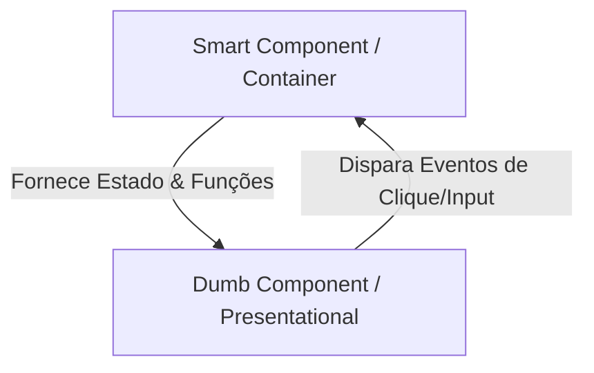

# 🧩 Componentes na Prática: Tipos e Padrões de Arquitetura

Estudo comparativo entre Componentes Funcionais e de Classe, bem como a implementação do padrão arquitetural de Smart vs. Dumb Components no React.

---

## ⚡ 1. Componentes Funcionais vs. Componentes de Classe

O React evoluiu a forma como estruturamos componentes. Existem dois modelos principais:

### A. Componentes de Classe (Class Components)
Era o padrão utilizado nas versões antigas do React (antes da versão 16.8). São baseados em classes ES6, utilizam herança de `React.Component`, e dependem da palavra-chave `this`.
*   **Estado:** Gerenciado via `this.state` e atualizado via `this.setState()`.
*   **Ciclo de Vida:** Controlado por métodos nativos de classe (`componentDidMount`, `componentDidUpdate`, `componentWillUnmount`).

```tsx
// Exemplo de Class Component
import React, { Component } from 'react';

class Contador extends Component {
  constructor(props) {
    super(props);
    this.state = { count: 0 };
  }

  componentDidMount() {
    console.log("Montado!");
  }

  render() {
    return (
      <button onClick={() => this.setState({ count: this.state.count + 1 })}>
        Cliques: {this.state.count}
      </button>
    );
  }
}
```

### B. Componentes Funcionais (Functional Components)
É o padrão **moderno e recomendado** do React hoje em dia. São funções Javascript simples que retornam JSX.
*   **Estado e Efeitos:** Utilizam **Hooks** (`useState`, `useEffect`, etc.).
*   **Vantagens:** Menos verbosos (menos linhas de código), sem necessidade de lidar com o escopo do `this`, mais fáceis de testar e com melhor performance.

```tsx
// Exemplo de Functional Component (Moderno)
import { useState, useEffect } from 'react';

function Contador() {
  const [count, setCount] = useState(0);

  useEffect(() => {
    console.log("Montado!");
  }, []);

  return (
    <button onClick={() => setCount(count + 1)}>
      Cliques: {count}
    </button>
  );
}
```

---

## ⚙️ 2. Padrão Smart Components vs. Dumb Components

Uma das melhores práticas para organizar o código em aplicações React de médio e grande porte é separar a **lógica** da **apresentação**. Essa arquitetura é dividida em dois tipos de componentes:



### A. Smart Components (Componentes Inteligentes ou Containers)
São os cérebros do aplicativo. Eles sabem **como as coisas funcionam**:
*   **Responsabilidade:** Buscar dados de APIs, gerenciar estado complexo, manipular lógica de negócios e lidar com efeitos colaterais.
*   **Aparência:** Possuem pouca ou nenhuma estilização e quase nenhuma estrutura HTML/CSS complexa. Eles apenas agrupam e alimentam componentes de apresentação.
*   **Comunicação:** Passam dados e funções de callback para componentes filhos via props.

### B. Dumb Components (Componentes Burros ou de Apresentação)
São a face do aplicativo. Eles sabem **como as coisas se parecem**:
*   **Responsabilidade:** Renderizar a interface visual baseando-se estritamente nas propriedades (props) que recebem do componente pai.
*   **Estado:** Raramente possuem estado próprio (no máximo estados visuais muito simples, como se um menu está aberto ou fechado).
*   **Reutilização:** São extremamente genéricos e reutilizáveis, pois não possuem dependências de APIs ou regras de negócios rígidas.

---

## 🛠️ Refatoração Arquitetural e High Order Components (HOCs)

Na prática, refatoramos o nosso projeto [smart-components](file:///c:/Users/Usuario/Desktop/santander-2026/03-react-front-end/13-componentes-na-pratica/smart-components/) para implementar de forma combinada os padrões de **Smart/Dumb Components** e **High Order Components (HOCs)**:

1.  **Dumb Component ([ProductsGrid.tsx](file:///c:/Users/Usuario/Desktop/santander-2026/03-react-front-end/13-componentes-na-pratica/smart-components/src/components/ProductsList/ProductsGrid.tsx)):** Recebe apenas a lista de produtos limpa via props e a exibe em tela. Não sabe nada sobre APIs ou estados de carregamento.
2.  **High Order Component ([withLoading.tsx](file:///c:/Users/Usuario/Desktop/santander-2026/03-react-front-end/13-componentes-na-pratica/smart-components/src/components/hocs/withLoading.tsx)):** Uma função pura que intercepta as props de qualquer componente recebido. Se `isLoading` for verdadeiro, renderiza a animação de carregamento; caso contrário, renderiza o componente original.
3.  **Smart Component ([ProductsList/index.tsx](file:///c:/Users/Usuario/Desktop/santander-2026/03-react-front-end/13-componentes-na-pratica/smart-components/src/components/ProductsList/index.tsx)):** Gerencia o fetch dos dados da API, controla o estado de `isLoading` e alimenta o componente composto `ProductsGridWithLoading`.

---

## 🔮 3. High Order Components (HOCs) Detalhado

Um **HOC** é um padrão avançado no React para reutilizar lógica de componentes. Ele é uma **função pura** que recebe um componente como parâmetro e retorna um novo componente enriquecido/modificado:

$$\text{Componente Enriquecido} = f(\text{Componente Original})$$

### Estrutura Inicial de um HOC:
O esqueleto básico de um HOC envolve retornar uma função componente que renderiza o componente envelopado:
```tsx
import React from 'react';

export function withFeature<P extends object>(WrappedComponent: React.ComponentType<P>) {
  return function EnhancedComponent(props: P) {
    // Adiciona lógica extra aqui...
    return <WrappedComponent {...props} />;
  };
}
```

### Casos de Uso Comuns para HOCs:
*   **Controle de Acesso / Proteção de Rotas:** Verificar se o usuário está logado antes de renderizar a página (`withAuth`).
*   **Estilização ou Temas Globais:** Injetar configurações de paleta de cores ou temas escuros/claros (`withTheme`).
*   **Tratamento de Carregamento ou Erros:** Exibir indicadores de carregamento enquanto dados assíncronos são buscados (`withLoading`).

---

## ⚡ 4. Aplicações Práticas e HOCs Baseados em Classes

### A. Reusabilidade com Múltiplos Componentes
A grande vantagem do padrão HOC é o reaproveitamento de código em diferentes partes da aplicação. No nosso projeto prático, criamos um segundo componente inteligente chamado [ClientsList/index.tsx](file:///c:/Users/Usuario/Desktop/santander-2026/03-react-front-end/13-componentes-na-pratica/smart-components/src/components/ClientsList/index.tsx) que consome dados de usuários.
*   Ambos os componentes (`ProductsList` e `ClientsList`) utilizam exatamente o **mesmo** HOC `withLoading`.
*   Isso prova que a lógica condicional de carregamento visual foi centralizada em uma única função pura de fácil manutenção.

### B. Criando um HOC Utilizando Componentes de Classe
Embora os componentes funcionais sejam a convenção moderna, também podemos escrever HOCs que utilizam a sintaxe de classes do ES6. Isso é extremamente útil em codebases legadas que precisam se comunicar com o ciclo de vida tradicional do React.

Criamos o HOC de logging chamado [withLogger.tsx](file:///c:/Users/Usuario/Desktop/santander-2026/03-react-front-end/13-componentes-na-pratica/smart-components/src/components/hocs/withLogger.tsx) usando classes:

```tsx
import { Component, ComponentType } from "react";

export function withLogger<P extends object>(WrappedComponent: ComponentType<P>) {
  // Retorna uma classe anônima que estende React.Component
  return class WithLogger extends Component<P> {
    componentDidMount() {
      console.log(`[Logger HOC] Componente montado com sucesso no DOM!`);
    }

    componentWillUnmount() {
      console.log(`[Logger HOC] Componente desmontado do DOM!`);
    }

    render() {
      // Repassa todas as props para o componente envelopado
      return <WrappedComponent {...this.props} />;
    }
  };
}
```

*   **Funcionamento:** Envolvemos as nossas listas (`ProductsList` e `ClientsList`) com `withLogger` na inicialização do `App.tsx`. Toda vez que a tela carrega, o ciclo de vida da classe do HOC intercepta a montagem e gera avisos de log organizados no console do desenvolvedor.


