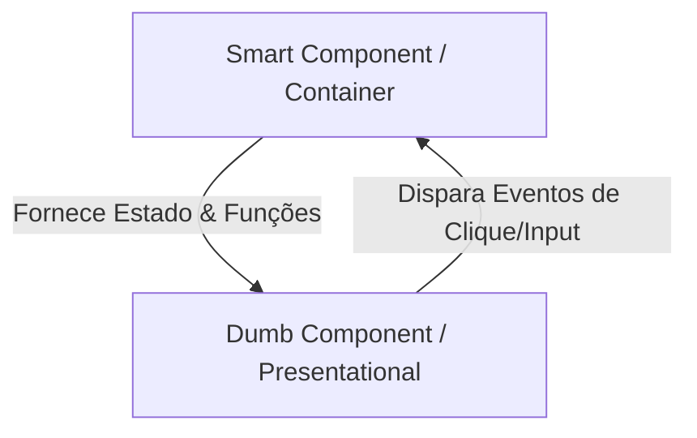

# 🧩 Componentes na Prática: Tipos e Padrões de Arquitetura

Estudo comparativo entre Componentes Funcionais e de Classe, bem como a implementação do padrão arquitetural de Smart vs. Dumb Components no React.

---

## ⚡ 1. Componentes Funcionais vs. Componentes de Classe

O React evoluiu a forma como estruturamos componentes. Existem dois modelos principais:

### A. Componentes de Classe (Class Components)
Era o padrão utilizado nas versões antigas do React (antes da versão 16.8). São baseados em classes ES6, utilizam herança de `React.Component`, e dependem da palavra-chave `this`.
*   **Estado:** Gerenciado via `this.state` e atualizado via `this.setState()`.
*   **Ciclo de Vida:** Controlado por métodos nativos de classe (`componentDidMount`, `componentDidUpdate`, `componentWillUnmount`).

```tsx
// Exemplo de Class Component
import React, { Component } from 'react';

class Contador extends Component {
  constructor(props) {
    super(props);
    this.state = { count: 0 };
  }

  componentDidMount() {
    console.log("Montado!");
  }

  render() {
    return (
      <button onClick={() => this.setState({ count: this.state.count + 1 })}>
        Cliques: {this.state.count}
      </button>
    );
  }
}
```

### B. Componentes Funcionais (Functional Components)
É o padrão **moderno e recomendado** do React hoje em dia. São funções Javascript simples que retornam JSX.
*   **Estado e Efeitos:** Utilizam **Hooks** (`useState`, `useEffect`, etc.).
*   **Vantagens:** Menos verbosos (menos linhas de código), sem necessidade de lidar com o escopo do `this`, mais fáceis de testar e com melhor performance.

```tsx
// Exemplo de Functional Component (Moderno)
import { useState, useEffect } from 'react';

function Contador() {
  const [count, setCount] = useState(0);

  useEffect(() => {
    console.log("Montado!");
  }, []);

  return (
    <button onClick={() => setCount(count + 1)}>
      Cliques: {count}
    </button>
  );
}
```

---

## ⚙️ 2. Padrão Smart Components vs. Dumb Components

Uma das melhores práticas para organizar o código em aplicações React de médio e grande porte é separar a **lógica** da **apresentação**. Essa arquitetura é dividida em dois tipos de componentes:



### A. Smart Components (Componentes Inteligentes ou Containers)
São os cérebros do aplicativo. Eles sabem **como as coisas funcionam**:
*   **Responsabilidade:** Buscar dados de APIs, gerenciar estado complexo, manipular lógica de negócios e lidar com efeitos colaterais.
*   **Aparência:** Possuem pouca ou nenhuma estilização e quase nenhuma estrutura HTML/CSS complexa. Eles apenas agrupam e alimentam componentes de apresentação.
*   **Comunicação:** Passam dados e funções de callback para componentes filhos via props.

### B. Dumb Components (Componentes Burros ou de Apresentação)
São a face do aplicativo. Eles sabem **como as coisas se parecem**:
*   **Responsabilidade:** Renderizar a interface visual baseando-se estritamente nas propriedades (props) que recebem do componente pai.
*   **Estado:** Raramente possuem estado próprio (no máximo estados visuais muito simples, como se um menu está aberto ou fechado).
*   **Reutilização:** São extremamente genéricos e reutilizáveis, pois não possuem dependências de APIs ou regras de negócios rígidas.

---

## 🛠️ Refatorando para Smart/Dumb na Prática
O arquivo [ProductsList/index.jsx](file:///c:/Users/Usuario/Desktop/santander-2026/03-react-front-end/13-componentes-na-pratica/smart-components/src/components/ProductsList/index.jsx) foi criado inicialmente como um **Smart Component** porque carrega a lógica de fetch da API e o estado de carregamento diretamente. 

Para melhorar o Design do código, podemos futuramente isolar a listagem em si em um componente burro (`ProductCard` ou `ProductGrid`) que recebe apenas a lista limpa de produtos e a renderiza.
